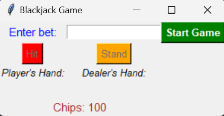

# Blackjack Game Using OOP and Tkinter in Python

## Overview

This is a simple Blackjack game built using Object-Oriented Programming (OOP) principles in Python with a graphical user interface (GUI) powered by Tkinter. The game allows the player to compete against a dealer in a traditional game of Blackjack, where the goal is to achieve a hand value of 21 or as close as possible without exceeding it.

## Features

1. **OOP Design:** The game follows Object-Oriented Programming principles with classes such as Card, Deck, Hand, and Chip.
2. **Graphical User Interface (GUI):** Built using Tkinter, providing an interactive interface for playing the game.
3. **Betting System:** Players can place bets using their starting chips and win or lose chips based on the outcome of each round.
4. **Dealer and Player Logic:** The dealer's hand is played automatically, following the rule that the dealer must keep drawing cards until reaching at least 17.
5. **Game Flow:** The game asks the player if they want to "Hit" (draw a card) or "Stand" (end their turn). The dealer then plays, and the winner is determined based on hand values.

## Game Play Instructions

To play a hand of Blackjack, follow these steps:

1. Start a new game by entering your bet amount (within your available chips) and clicking "Start Game."
2. The game will deal two cards to both the player and the dealer. The dealer's second card will be hidden initially.
3. You can choose to Hit (draw another card) or Stand (end your turn). If you choose "Hit," you'll receive an additional card.
4. If your hand value exceeds 21 after hitting, you bust and lose the round automatically.
5. The dealer will play their turn once the player stands. The dealer draws cards until their hand value is 17 or higher.
6. If the player’s hand value is greater than the dealer's without busting, the player wins the round. Otherwise, the dealer wins.
7. After the round ends, you can choose to play again by clicking the "Play Again" button.

## Game Rules

1. The game is played with a standard 52-card deck.
2. Each card in the deck has a rank (Two, Three, ..., King, Ace) and a suit (Hearts, Diamonds, Spades, Clubs).
3. Number cards (2-10) are worth their face value.
4. Face cards (Jack, Queen, King) are each worth 10 points.
5. Aces can be worth either 1 or 11 points, depending on which is more beneficial for the hand.
6. The objective is to get a hand value as close to 21 as possible, without exceeding it.

## Classes Overview

1. Card - Represents a single card with a suit and a rank.
2. Deck - Represents a deck of 52 cards. Includes functionality to shuffle the deck and deal cards.
3. Hand - Represents a player's or dealer's hand of cards. Includes logic to calculate the hand's total value and adjust for Aces (if necessary).
4. Chip - Represents the player's chips. Includes functionality to manage the player's total chips, place a bet, and win/lose bets.

## Game Snapshots

## Future Enhancements

1. Implementing a multiplayer version where users can play with other people.
2. Adding more visual effects or animations to enhance the player experience.
3. Support for customizing the initial chips amount and additional betting options.

## Reference

[Milestone Project from Pierian-Data Python Bootcamp](https://www.udemy.com/course/complete-python-bootcamp)
